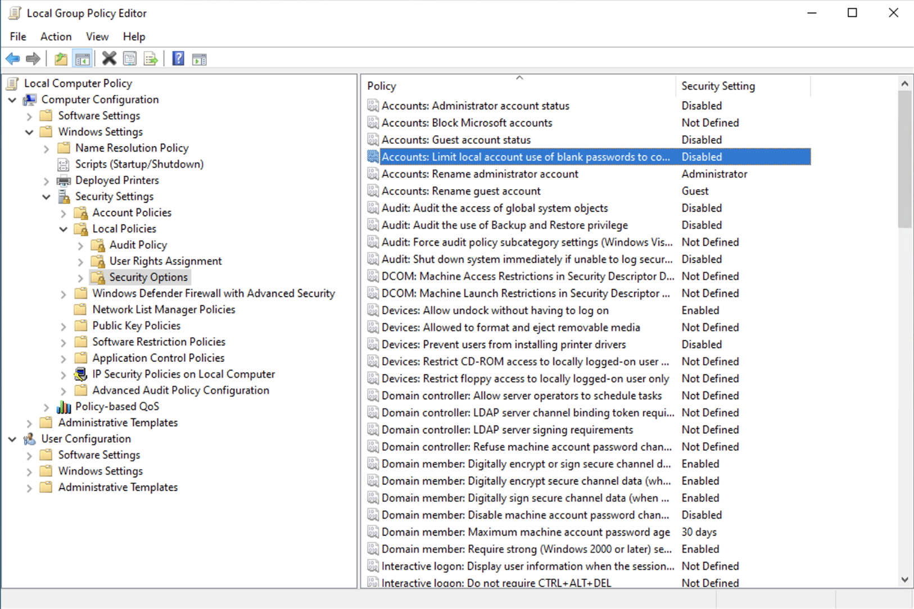
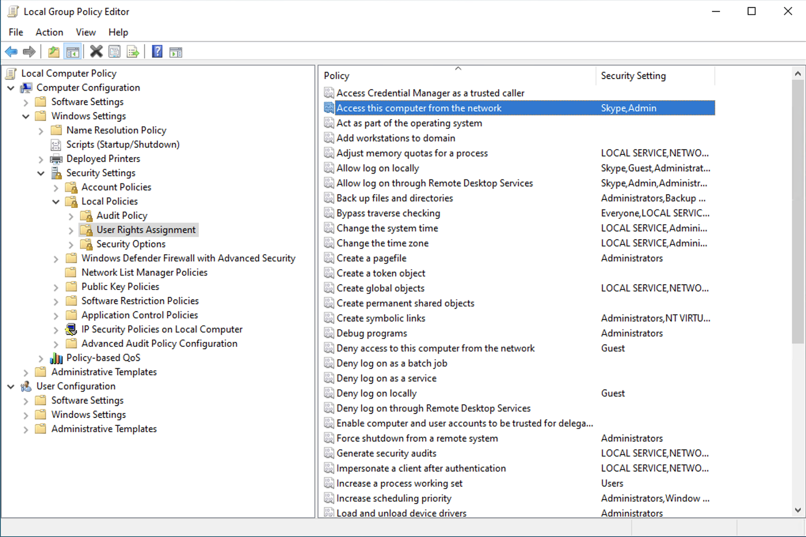
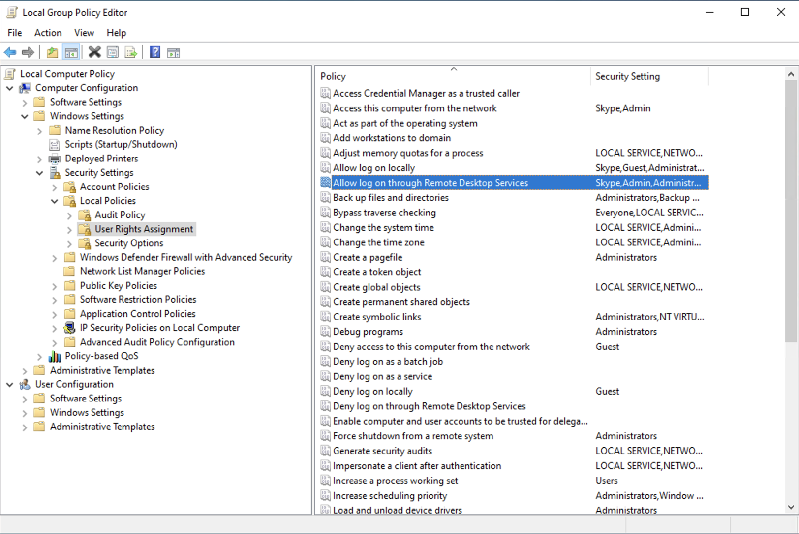

# Microsoft Teams Rooms (MTR)
Configurations and hints


## Creating and preparing room account
It has to be configured, otherwise MTR will show the Organizer as Subject
```
Set-CalendarProcessing -Identity "Conf" -DeleteSubject $False -AddOrganizerToSubject $False
```
It has to be configured, otherwise MTR will not accept external meeting invitations (DeleteComments to be sure to make MTR clean in the overview) 
```
Set-CalendarProcessing -Identity "Conf" -ProcessExternalMeetingMessages $true -DeleteComments $False

```


## Setting up the Teams Rooms Console

## Updating Teams Rooms Console

### With Microsoft Store
Search for Microsoft Store in your Windows 10 enviroment and then the dots icon (...) and click on Downloads. 
There you should find the app Skype Rooms Systems which is actually Teams Rooms Console. Or try this [link](https://www.microsoft.com/en-us/p/skype-room-system/9nblggh5799l?).

### Manually with PS
At first you need the [Skype Room System Deployment Kit](https://go.microsoft.com/fwlink/?linkid=851168). 
After the download the location for the files is `C:\Program Files (x86)\Skype Room System Deployment Kit`
You can find the reference document [here](https://docs.microsoft.com/en-us/microsoftteams/rooms/rooms-operations#to-update-using-powershell).
I prefere to do this locally directly on the MTR client, so copy the content e.g. in `C:\Temp` and execute:
```
Add-AppxPackage -Update -ForceApplicationShutdown -Path 'C:\Temp\Skype Room System Deployment Kit\$oem$\$1\Rigel\x64\Ship\AppPackages\*\*.appx' -DependencyPath (Get-ChildItem 'C:\Temp\Skype Room System Deployment Kit\$oem$\$1\Rigel\x64\Ship\AppPackages\*\Dependencies\x64\*.appx' | Foreach-Object {$_.FullName})
```
After execute, you won"t see any messages, so just restart the hardware and check the App version in MTR.

## Setting up Remote access for Teams Rooms Console
Login with admin credentials (User: admin, Password: sfb) and open the Local Group Policy Editor (gpedit.msc).
Go to Computer Configuration -> Windows Settings -> Security Settings -> Local Policies -> Security Option and double-click "Accounts: Limit local account use of blank passwords to console login only" and disable this part.


Next go to Computer Configuration -> Windows Settings -> Security Settings -> Local Policies -> User Rights Assignments and double-click "Allow log on through Remote Desktop Service". Click "Add User or Group" and select the Skype and Administrator user.


Well, now go to Computer Configuration -> Windows Settings -> Security Settings -> Local Policies -> User Rights Assignments and double-click "Access this computer from the network". Also here, select Skype and Administrator user and add them.


The last config is enabling Microsoft Remote Desktop. Open the Windows Explorer and right-click to "This PC" and choose "Properties". Next click "Remote settings" and select the tab "Remote". 
Make sure the checkbox for "Allow Remote Assistance connections to this computer" is enabled and select also "Allow remote connections to this computer" and "Allow connections only from computer running Remote Desktop with Network Level Authentication (recommended)"


## Additional setting
It is possible to create a easier experience for [booking rooms in Outlook](https://techcommunity.microsoft.com/t5/exchange-team-blog/easier-room-booking-in-outlook-on-the-web/ba-p/743349).
```
Set-Place -Identity "Conf-Room" -AudioDeviceName $null -City "Melbourne" -CountryOrRegion "Australia" -DisplayDeviceName "HP Elite Slice G2" -FloorLabel "Second Level" -GeoCoordinates "-37.8456457; 144.9777676" -IsWheelChairAccessible $true -PostalCode "VIC 3004" -State "Victoria" -Street "XXX St Kilda Rd" -VideoDeviceName $null
```
Also you can add this room to a distributiongroup only for rooms, which will detect as catagory in Outlook
```
Add-DistributionGroupMember -Identity “Rooms In Melbourne“ -Member conf-room@xxx.com
```


## Relevanted links
* [MTR devices](https://www.microsoft.com/en-us/microsoft-365/microsoft-teams/across-devices/devices) 
* [MTR release notes](https://docs.microsoft.com/en-us/microsoftteams/rooms/rooms-release-note) 
* [MTR maintenance and operations](https://docs.microsoft.com/en-us/microsoftteams/rooms/rooms-operations#RemotePS) 
* [MTR XML config file](https://docs.microsoft.com/en-us/MicrosoftTeams/rooms/xml-config-file) 
* [MTR manage with Teams Admin Console](https://docs.microsoft.com/en-us/MicrosoftTeams/rooms/rooms-manage#updating-the-microsoft-teams-rooms-os-and-microsoft-teams-rooms-application)
* []()
